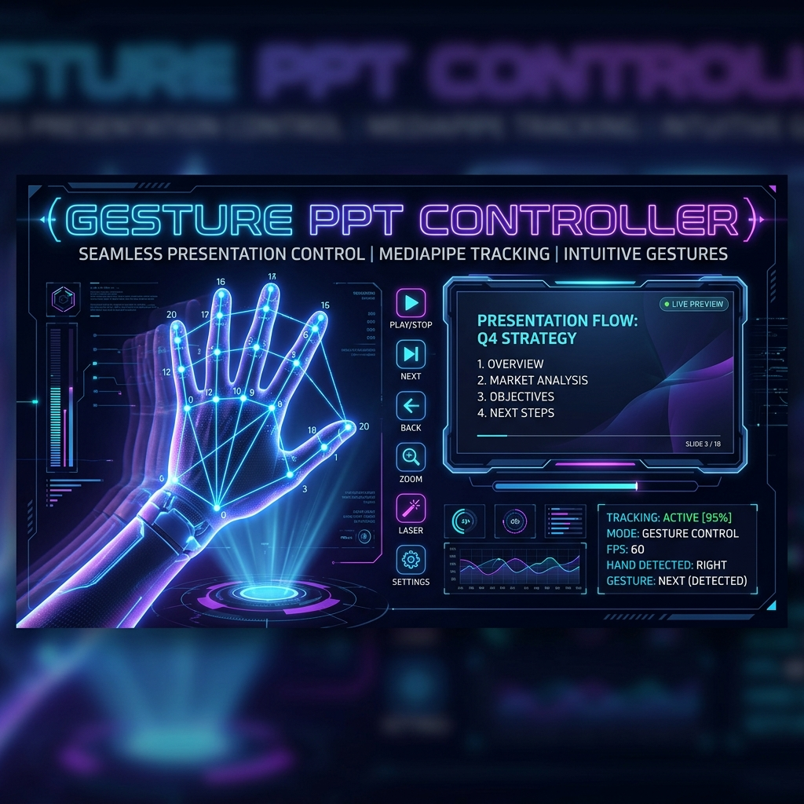

<div align="center">
  

  # Smart PPT Controller

  **A computer-vision and voice-controlled PowerPoint presentation controller.**

  [](https://www.python.org/)
  [](#installation)
  [](https://mediapipe.dev/)
  [](https://opencv.org/)
  [](LICENSE)

</div>

---

## 📌 Overview

**Smart PPT Controller** is a modern, touchless presentation control system. It allows presenters to navigate slides, trigger laser pointer modes, and control presentations using **real-time hand gestures** via webcam and **voice commands** via microphone without touching a keyboard, mouse, or clicker.

---

## ✨ Features

- 🖐️ **Real-Time Hand Gesture Control** (MediaPipe 21-landmark Video Mode + skin contour fallback).
- 🗣️ **Voice Command Recognition** (`"Next"`, `"Back"`, `"Start"`, `"End"`).
- 📄 **PDF & PPTX Presentation Support** (Native PowerPoint COM automation & PyMuPDF rendering).
- 💻 **Interactive Web HUD Dashboard** (Flask live video stream & slide preview).
- 📦 **CLI & Executable Python Package**: Runnable globally via `smart-ppt-controller` from any directory.

---

## 💻 System Requirements

- **Operating System**: Windows 10/11 (Recommended for Microsoft PowerPoint COM automation).
- **Python**: Python 3.9 – 3.11.
- **Hardware**: Webcam and Microphone.

---

## 🚀 Installation

Install directly from GitHub via `pip`:

```bash
pip install git+https://github.com/DurgaPraveen07/smart_ppt_controller.git
```

---

## 🏃 Usage

Once installed, you can launch the application from **ANY** working directory:

### Option 1: Direct CLI Command
```bash
smart-ppt-controller
```

### Option 2: Python Module Execution
```bash
python -m smart_ppt_controller
```

Open your browser and navigate to: **`http://localhost:5000`**

---

## 🎮 Controls & Commands

### 🖐️ Hand Gestures

| Gesture | Action |
| :--- | :--- |
| **Swipe Right / Open Palm Right** | Next Slide |
| **Swipe Left / Open Palm Left** | Previous Slide |
| **Index Point Finger** | Laser Pointer Mode |
| **Victory / Peace Sign (`V`)** | Toggle Drawing / Annotation Mode |
| **Closed Fist** | Pause Gesture Tracking / Freeze State |
| **Thumbs Up** | Jump to First Slide |

### 🗣️ Voice Commands

| Voice Command | Action |
| :--- | :--- |
| `"Next"` / `"Forward"` / `"Right"` | Advance to next slide |
| `"Back"` / `"Previous"` / `"Left"` | Go to previous slide |
| `"Start"` / `"First"` / `"Beginning"` | Jump to beginning slide |
| `"End"` / `"Last"` | Jump to final slide |

---

## 📁 Package Architecture

```text
smart_ppt_controller/
├── pyproject.toml              # Setuptools package metadata & entry points
├── requirements.txt            # Runtime dependencies
├── README.md                   # Documentation
├── LICENSE                     # MIT License
├── start.bat                   # Windows batch starter
│
└── smart_ppt_controller/
    ├── __init__.py             # Package version definition
    ├── __main__.py             # Module execution entrypoint
    ├── cli.py                  # CLI argument parser & runner
    ├── app.py                  # Flask server & web endpoints
    ├── gesture/
    │   └── recognizer.py       # MediaPipe gesture detection
    ├── voice/
    │   └── commands.py         # Voice recognition thread
    ├── ppt/
    │   └── controller.py       # PDF/PPTX conversion & state logic
    ├── web/
    │   ├── templates/index.html
    │   └── static/
    ├── assets/
    │   └── banner.png
    └── models/
        └── gesture_recognizer.task # MediaPipe model asset
```

---

## 🛠️ Development Setup

To modify or contribute locally:

```bash
git clone https://github.com/DurgaPraveen07/smart_ppt_controller.git
cd smart_ppt_controller
pip install -e .
```

---

## ❓ Troubleshooting

1. **Camera Not Opening**: Ensure no other application (e.g. Zoom, Teams) is using your webcam.
2. **PowerPoint COM Export Error**: Make sure Microsoft PowerPoint is installed on your Windows system when uploading `.pptx` files. Alternatively, upload `.pdf` presentations which use PyMuPDF.

---

## 📜 License

Distributed under the MIT License. See [`LICENSE`](LICENSE) for more information.